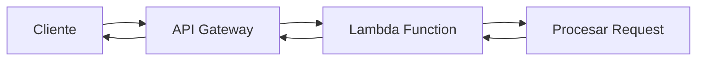

# AWS Lambda Go API

> **🌐 Idiomas**: [English](README.md) | **Español**

Una API REST construida con Go y Gin Framework, diseñada para ejecutarse tanto como AWS Lambda función (usando contenedores Docker) como servicio HTTP tradicional para desarrollo local.


## ⚡ ¿Qué significa ejecutar AWS Lambda como API?

AWS Lambda es un servicio de computación **serverless** (sin servidor) que ejecuta código en respuesta a eventos, sin necesidad de aprovisionar o administrar servidores. Cuando hablamos de "ejecutar Lambda como API", nos referimos a usar funciones Lambda como backend de una API REST, donde cada request HTTP se convierte en una invocación de la función.

### 🔄 ¿Cómo funciona?

1. **Cliente** → envía request HTTP a una URL
2. **API Gateway** → recibe el request y lo transforma en un evento Lambda
3. **Lambda Function** → procesa el evento y retorna una respuesta
4. **API Gateway** → convierte la respuesta Lambda a formato HTTP
5. **Cliente** → recibe la respuesta HTTP estándar



### 🚀 Ventajas de usar AWS Lambda para APIs

#### **💰 Costo Optimizado**
- **Pago por uso**: Solo pagas por el tiempo de ejecución real (facturación por milisegundos)
- **Sin costos fijos**: No hay servidores corriendo 24/7 consumiendo recursos
- **Escalado a cero**: Cuando no hay tráfico, el costo es $0
- **Comparativa**: Una API con 1M requests/mes puede costar ~$20 vs ~$50-200 en EC2

#### **📈 Escalabilidad Automática**
- **Auto-scaling**: Maneja desde 1 hasta miles de requests concurrentes automáticamente
- **Sin configuración**: No necesitas configurar load balancers o auto-scaling groups
- **Respuesta instantánea**: Se adapta a picos de tráfico sin intervención manual
- **Concurrencia**: Hasta 1,000 ejecuciones concurrentes por defecto (escalable)

### 📊 Casos de Uso Ideales

✅ **APIs REST/GraphQL con tráfico variable**  
✅ **Microservicios y arquitecturas event-driven**  
✅ **Aplicaciones con patrones de uso impredecibles**  
✅ **Startups y MVPs con presupuesto limitado**  
✅ **APIs que requieren alta disponibilidad sin gestión**

### ⚠️ Consideraciones

- **Cold starts**: Primera invocación puede tomar 100-1000ms (mitigable con SnapStart)
- **Límite de tiempo**: Máximo 15 minutos de ejecución por invocación
- **Límite de memoria**: Máximo 10GB RAM por función
- **Límite de payload**: 6MB para requests síncronos


## 📋 Descripción General

Esta aplicación es una API REST que proporciona endpoints básicos como health check, echo y tiempo del servidor. Está optimizada para desplegarse en AWS Lambda usando contenedores Docker y cuenta con un pipeline de CI/CD automatizado con GitHub Actions.

La aplicación utiliza un patrón híbrido que permite:
- **Producción**: Ejecutión como AWS Lambda función a través de API Gateway
- **Desarrollo**: Servidor HTTP tradicional para pruebas locales

## 🏗️ Arquitectura del Proyecto

```
aws-lambda-go/
├── .github/workflows/     # Pipeline CI/CD con GitHub Actions
│   └── main.yml          # Workflow de build y deploy
├── cmd/                  # Punto de entrada de la aplicación
│   └── main.go          # Lógica de arranque híbrida (Lambda/HTTP)
├── docker_images/        # Configuraciones Docker
│   ├── deploy/          # Dockerfile para AWS Lambda
│   │   └── Dockerfile.deploy
│   └── local/           # Dockerfile para desarrollo local
│       └── Dockerfile.local
├── internal/            # Código interno de la aplicación
│   ├── middleware/      # Middlewares personalizados
│   │   └── logger.go    # Middleware de logging y observabilidad
│   └── router/          # Configuración de rutas
│       └── router.go    # Definición de endpoints y handlers
├── compose.yml          # Docker Compose para desarrollo
├── go.mod              # Dependencias del proyecto
└── go.sum             # Lock file de dependencias
```

## 🚀 Modos de Ejecución

### 1. Modo Lambda (Producción)

La aplicación detecta automáticamente si está ejecutándose en AWS Lambda mediante la variable de entorno `AWS_LAMBDA_FUNCTION_NAME`:

```go
if _, inLambda := os.LookupEnv("AWS_LAMBDA_FUNCTION_NAME"); inLambda {
    lambda.Start(ginadapter.NewV2(r).ProxyWithContext)
    return
}
```

**Características:**
- Usa `aws-lambda-go-api-proxy` para adaptar Gin a Lambda
- Se despliega como imagen Docker en ECR
- Invocación a través de API Gateway
- Auto-escalado y facturación por uso

### 2. Modo HTTP Local (Desarrollo)

Cuando no se detecta el entorno Lambda, la aplicación inicia un servidor HTTP tradicional:

```go
port := os.Getenv("PORT")
if port == "" {
    port = "8080"
}
r.Run(":" + port)
```

**Características:**
- Servidor HTTP directo en puerto configurable (default: 8080)
- Ideal para desarrollo y testing local
- Logs detallados con middleware personalizado

## 🐳 Docker y Contenedores

### Dockerfile.deploy (Producción/Lambda)

```dockerfile
# Multi-stage build para AWS Lambda
FROM amazonlinux:2 as builder
# ... compilación estática
FROM public.ecr.aws/lambda/go:1
COPY --from=builder /app/app ${LAMBDA_TASK_ROOT}
CMD ["app"]
```

**Optimizaciones:**
- Build estático (`CGO_ENABLED=0`)
- Imagen base oficial de AWS Lambda para Go
- Tamaño reducido con flags `-ldflags="-s -w"`

### Dockerfile.local (Desarrollo)

```dockerfile
# Multi-stage build para desarrollo local
FROM golang:1.24-alpine AS builder
# ... compilación
FROM alpine:latest
# ... imagen final mínima
EXPOSE 8080
CMD ["./server"]
```

**Características:**
- Imagen Alpine mínima para desarrollo
- Puerto 8080 expuesto por defecto
- Certificados CA incluidos para HTTPS

## 🐙 Docker Compose

El archivo `compose.yml` define dos servicios para diferentes casos de uso:

### app-lambda
```yaml
services:
  app-lambda:
    build:
      dockerfile: docker_images/deploy/Dockerfile.deploy
    ports:
      - "9000:8080"
```

**Uso:**
```bash
# Levantar emulación Lambda local
docker-compose up app-lambda

# Invocar la función vía Lambda Runtime API
curl -XPOST "http://localhost:9000/2015-03-31/functions/function/invocations" \
  -d '{"httpMethod":"GET", "path":"/health"}'
```

### app-api
```yaml
services:
  app-api:
    build:
      dockerfile: docker_images/local/Dockerfile.local
    ports:
      - "9000:8080"
```

**Uso:**
```bash
# Levantar API HTTP tradicional
docker-compose up app-api

# Consumir directamente vía HTTP
curl http://localhost:9000/health
```

## 🛣️ Endpoints Disponibles

La API expone los siguientes endpoints definidos en `internal/router/router.go`:

| Endpoint | Método | Descripción |
|----------|---------|-------------|
| `/` | GET | Página de bienvenida con información de la API |
| `/health` | GET | Health check - retorna `{"status": "ok"}` |
| `/echo` | POST | Echo service - retorna el JSON enviado |
| `/time` | GET | Tiempo actual del servidor en formato RFC3339 |

### Ejemplos de Uso

```bash
# Health check
curl https://your-api-gateway-url/health

# Echo service
curl -X POST https://your-api-gateway-url/echo \
  -H "Content-Type: application/json" \
  -d '{"message": "Hello World"}'

# Server time
curl https://your-api-gateway-url/time
```

## 🔧 Middleware y Observabilidad

### Middleware de Logging

El proyecto incluye un middleware personalizado en `internal/middleware/logger.go`:

```go
func RequestLogger() gin.HandlerFunc {
    return func(c *gin.Context) {
        start := time.Now()
        c.Next()
        log.Printf("[REQ] %3d | %-7s | %s | %v",
            c.Writer.Status(),
            c.Request.Method,
            c.Request.URL.Path,
            time.Since(start),
        )
    }
}
```

**Características:**
- Logging de todas las requests con duración
- Formato consistente: `[REQ] STATUS | METHOD | PATH | DURATION`
- Integración automática con CloudWatch Logs en Lambda

## 🚀 Pipeline CI/CD

El workflow de GitHub Actions (`.github/workflows/main.yml`) automatiza el proceso completo de despliegue:

### Flujo de Trabajo

1. **Trigger**: Push a ramas `main` o `development`
2. **Build Stage**:
   - Configuración de credenciales AWS
   - Login a ECR (Elastic Container Registry)
   - Mapeo de rama a entorno (`main` → `prod`, `development` → `dev`)
   - Build de imagen Docker usando `Dockerfile.deploy`
   - Tag con timestamp: `{environment}-{YYYYMMDDTHHMMSSZ}`
   - Push a ECR con tags versioned y latest

3. **Deploy Stage**:
   - Actualización de la función Lambda con nueva imagen
   - Espera confirmación de actualización exitosa
   - Publicación de nueva versión de Lambda

### Configuración de Entornos

```yaml
BRANCH_ENV_MAP: '{"main": "prod", "development": "dev", "staging": "stg", "testing": "tst"}'
```

### Variables de Entorno Requeridas

| Secret | Descripción |
|--------|-------------|
| `AWS_ACCESS_KEY_ID` | Clave de acceso AWS |
| `AWS_SECRET_ACCESS_KEY` | Clave secreta AWS |
| `AWS_DEFAULT_REGION` | Región AWS (ej: us-east-1) |
| `ECR_REGISTRY` | URI del registro ECR |
| `ECR_REPO_NAME` | Nombre del repositorio ECR |
| `AWS_LAMBDA_BASE_NAME` | Nombre base de la función Lambda |

### Nomenclatura de Recursos

- **Imágenes ECR**: `{ECR_REGISTRY}/{ECR_REPO_NAME}:{environment}-{version}`
- **Función Lambda**: `{AWS_LAMBDA_BASE_NAME}-{environment}`

Ejemplo:
- Imagen: `123456789.dkr.ecr.us-east-1.amazonaws.com/my-app:prod-20240115T143022Z`
- Lambda: `my-lambda-function-prod`

## 🔧 Desarrollo Local

### Prerrequisitos

- Go 1.24+
- Docker y Docker Compose

### Configuración

```bash
# Clonar repositorio
git clone <repository-url>
cd aws-lambda-go

# Instalar dependencias
go mod download

# Ejecutar localmente (modo HTTP)
go run cmd/main.go
```

### Variables de Entorno

| Variable | Descripción | Default |
|----------|-------------|---------|
| `PORT` | Puerto para modo HTTP local | `8080` |
| `ROOT_PATH` | Ruta base de la API | `/` |
| `AWS_LAMBDA_FUNCTION_NAME` | Detecta modo Lambda (auto) | - |

### Testing con Docker

```bash
# API HTTP tradicional
docker-compose up app-api
curl http://localhost:9000/health

# Emulación Lambda local
docker-compose up app-lambda
curl -XPOST "http://localhost:9000/2015-03-31/functions/function/invocations" \
  -d '{"httpMethod":"GET", "path":"/health"}'
``` 