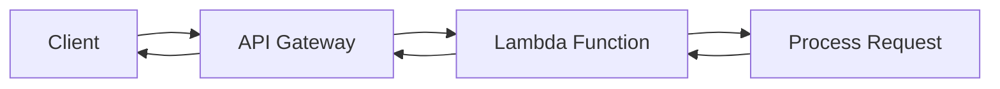

# AWS Lambda Go API

> **🌐 Languages**: **English** | [Español](README.es.md)

A REST API built with Go and Gin Framework, designed to run both as an AWS Lambda function (using Docker containers) and as a traditional HTTP service for local development.


## ⚡ What does running AWS Lambda as an API mean?

AWS Lambda is a **serverless** computing service that executes code in response to events, without the need to provision or manage servers. When we talk about "running Lambda as API", we refer to using Lambda functions as the backend of a REST API, where each HTTP request becomes a Lambda function invocation.

### 🔄 How does it work?

1. **Client** → sends HTTP request to a URL
2. **API Gateway** → receives the request and transforms it into a Lambda event
3. **Lambda Function** → processes the event and returns a response
4. **API Gateway** → converts the Lambda response to HTTP format
5. **Client** → receives the standard HTTP response



### 🚀 Advantages of using AWS Lambda for APIs

#### **💰 Cost Optimized**
- **Pay per use**: Only pay for actual execution time (billed by milliseconds)
- **No fixed costs**: No servers running 24/7 consuming resources
- **Scale to zero**: When there's no traffic, the cost is $0
- **Comparison**: An API with 1M requests/month can cost ~$20 vs ~$50-200 on EC2

#### **📈 Automatic Scalability**
- **Auto-scaling**: Handles from 1 to thousands of concurrent requests automatically
- **No configuration**: No need to configure load balancers or auto-scaling groups
- **Instant response**: Adapts to traffic spikes without manual intervention
- **Concurrency**: Up to 1,000 concurrent executions by default (scalable)

### 📊 Ideal Use Cases

✅ **REST/GraphQL APIs with variable traffic**  
✅ **Microservices and event-driven architectures**  
✅ **Applications with unpredictable usage patterns**  
✅ **Startups and MVPs with limited budget**  
✅ **APIs requiring high availability without management**

### ⚠️ Considerations

- **Cold starts**: First invocation can take 100-1000ms (mitigable with SnapStart)
- **Time limit**: Maximum 15 minutes execution per invocation
- **Memory limit**: Maximum 10GB RAM per function
- **Payload limit**: 6MB for synchronous requests


## 📋 General Description

This application is a REST API that provides basic endpoints such as health check, echo, and server time. It's optimized for deployment on AWS Lambda using Docker containers and features an automated CI/CD pipeline with GitHub Actions.

The application uses a hybrid pattern that allows:
- **Production**: Execution as AWS Lambda function through API Gateway
- **Development**: Traditional HTTP server for local testing

## 🏗️ Project Architecture

```
aws-lambda-go/
├── .github/workflows/     # CI/CD Pipeline with GitHub Actions
│   └── main.yml          # Build and deploy workflow
├── cmd/                  # Application entry point
│   └── main.go          # Hybrid startup logic (Lambda/HTTP)
├── docker_images/        # Docker configurations
│   ├── deploy/          # Dockerfile for AWS Lambda
│   │   └── Dockerfile.deploy
│   └── local/           # Dockerfile for local development
│       └── Dockerfile.local
├── internal/            # Internal application code
│   ├── middleware/      # Custom middlewares
│   │   └── logger.go    # Logging and observability middleware
│   └── router/          # Route configuration
│       └── router.go    # Endpoint and handler definitions
├── compose.yml          # Docker Compose for development
├── go.mod              # Project dependencies
└── go.sum             # Dependencies lock file
```

## 🚀 Execution Modes

### 1. Lambda Mode (Production)

The application automatically detects if it's running in AWS Lambda using the `AWS_LAMBDA_FUNCTION_NAME` environment variable:

```go
if _, inLambda := os.LookupEnv("AWS_LAMBDA_FUNCTION_NAME"); inLambda {
    lambda.Start(ginadapter.NewV2(r).ProxyWithContext)
    return
}
```

**Features:**
- Uses `aws-lambda-go-api-proxy` to adapt Gin to Lambda
- Deployed as Docker image in ECR
- Invocation through API Gateway
- Auto-scaling and pay-per-use billing

### 2. Local HTTP Mode (Development)

When Lambda environment is not detected, the application starts a traditional HTTP server:

```go
port := os.Getenv("PORT")
if port == "" {
    port = "8080"
}
r.Run(":" + port)
```

**Features:**
- Direct HTTP server on configurable port (default: 8080)
- Ideal for development and local testing
- Detailed logs with custom middleware

## 🐳 Docker and Containers

### Dockerfile.deploy (Production/Lambda)

```dockerfile
# Multi-stage build for AWS Lambda
FROM amazonlinux:2 as builder
# ... static compilation
FROM public.ecr.aws/lambda/go:1
COPY --from=builder /app/app ${LAMBDA_TASK_ROOT}
CMD ["app"]
```

**Optimizations:**
- Static build (`CGO_ENABLED=0`)
- Official AWS Lambda base image for Go
- Reduced size with flags `-ldflags="-s -w"`

### Dockerfile.local (Development)

```dockerfile
# Multi-stage build for local development
FROM golang:1.24-alpine AS builder
# ... compilation
FROM alpine:latest
# ... minimal final image
EXPOSE 8080
CMD ["./server"]
```

**Features:**
- Minimal Alpine image for development
- Port 8080 exposed by default
- CA certificates included for HTTPS

## 🐙 Docker Compose

The `compose.yml` file defines two services for different use cases:

### app-lambda
```yaml
services:
  app-lambda:
    build:
      dockerfile: docker_images/deploy/Dockerfile.deploy
    ports:
      - "9000:8080"
```

**Usage:**
```bash
# Start local Lambda emulation
docker-compose up app-lambda

# Invoke function via Lambda Runtime API
curl -XPOST "http://localhost:9000/2015-03-31/functions/function/invocations" \
  -d '{"httpMethod":"GET", "path":"/health"}'
```

### app-api
```yaml
services:
  app-api:
    build:
      dockerfile: docker_images/local/Dockerfile.local
    ports:
      - "9000:8080"
```

**Usage:**
```bash
# Start traditional HTTP API
docker-compose up app-api

# Consume directly via HTTP
curl http://localhost:9000/health
```

## 🛣️ Available Endpoints

The API exposes the following endpoints defined in `internal/router/router.go`:

| Endpoint | Method | Description |
|----------|---------|-------------|
| `/` | GET | Welcome page with API information |
| `/health` | GET | Health check - returns `{"status": "ok"}` |
| `/echo` | POST | Echo service - returns the sent JSON |
| `/time` | GET | Current server time in RFC3339 format |

### Usage Examples

```bash
# Health check
curl https://your-api-gateway-url/health

# Echo service
curl -X POST https://your-api-gateway-url/echo \
  -H "Content-Type: application/json" \
  -d '{"message": "Hello World"}'

# Server time
curl https://your-api-gateway-url/time
```

## 🔧 Middleware and Observability

### Logging Middleware

The project includes a custom middleware in `internal/middleware/logger.go`:

```go
func RequestLogger() gin.HandlerFunc {
    return func(c *gin.Context) {
        start := time.Now()
        c.Next()
        log.Printf("[REQ] %3d | %-7s | %s | %v",
            c.Writer.Status(),
            c.Request.Method,
            c.Request.URL.Path,
            time.Since(start),
        )
    }
}
```

**Features:**
- Logging of all requests with duration
- Consistent format: `[REQ] STATUS | METHOD | PATH | DURATION`
- Automatic integration with CloudWatch Logs in Lambda

## 🚀 CI/CD Pipeline

The GitHub Actions workflow (`.github/workflows/main.yml`) automates the complete deployment process:

### Workflow

1. **Trigger**: Push to `main` or `development` branches
2. **Build Stage**:
   - AWS credentials configuration
   - ECR (Elastic Container Registry) login
   - Branch to environment mapping (`main` → `prod`, `development` → `dev`)
   - Docker image build using `Dockerfile.deploy`
   - Tag with timestamp: `{environment}-{YYYYMMDDTHHMMSSZ}`
   - Push to ECR with versioned and latest tags

3. **Deploy Stage**:
   - Lambda function update with new image
   - Wait for successful update confirmation
   - Publish new Lambda version

### Environment Configuration

```yaml
BRANCH_ENV_MAP: '{"main": "prod", "development": "dev", "staging": "stg", "testing": "tst"}'
```

### Required Environment Variables

| Secret | Description |
|--------|-------------|
| `AWS_ACCESS_KEY_ID` | AWS access key |
| `AWS_SECRET_ACCESS_KEY` | AWS secret key |
| `AWS_DEFAULT_REGION` | AWS region (e.g., us-east-1) |
| `ECR_REGISTRY` | ECR registry URI |
| `ECR_REPO_NAME` | ECR repository name |
| `AWS_LAMBDA_BASE_NAME` | Lambda function base name |

### Resource Naming Convention

- **ECR Images**: `{ECR_REGISTRY}/{ECR_REPO_NAME}:{environment}-{version}`
- **Lambda Function**: `{AWS_LAMBDA_BASE_NAME}-{environment}`

Example:
- Image: `123456789.dkr.ecr.us-east-1.amazonaws.com/my-app:prod-20240115T143022Z`
- Lambda: `my-lambda-function-prod`

## 🔧 Local Development

### Prerequisites

- Go 1.24+
- Docker and Docker Compose

### Setup

```bash
# Clone repository
git clone <repository-url>
cd aws-lambda-go

# Install dependencies
go mod download

# Run locally (HTTP mode)
go run cmd/main.go
```

### Environment Variables

| Variable | Description | Default |
|----------|-------------|---------|
| `PORT` | Port for local HTTP mode | `8080` |
| `ROOT_PATH` | API base path | `/` |
| `AWS_LAMBDA_FUNCTION_NAME` | Detects Lambda mode (auto) | - |

### Testing with Docker

```bash
# Traditional HTTP API
docker-compose up app-api
curl http://localhost:9000/health

# Local Lambda emulation
docker-compose up app-lambda
curl -XPOST "http://localhost:9000/2015-03-31/functions/function/invocations" \
  -d '{"httpMethod":"GET", "path":"/health"}'
```
